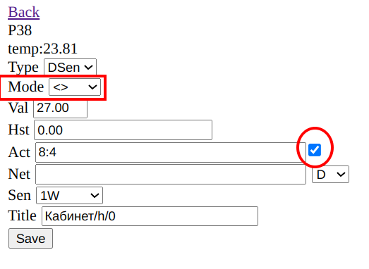
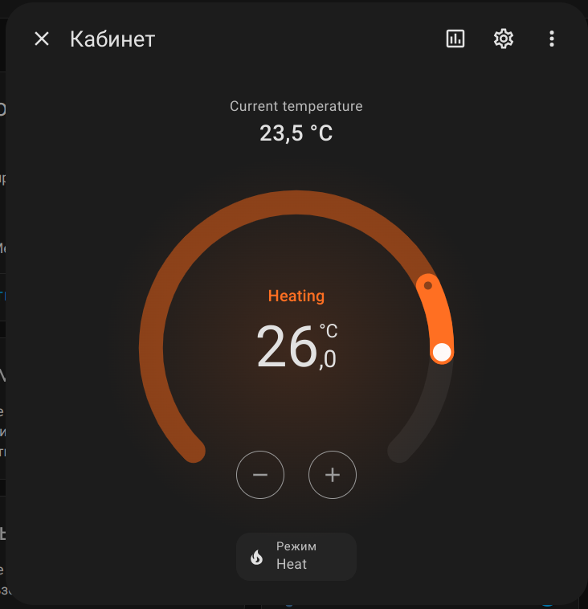
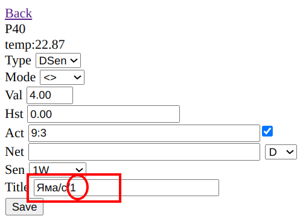
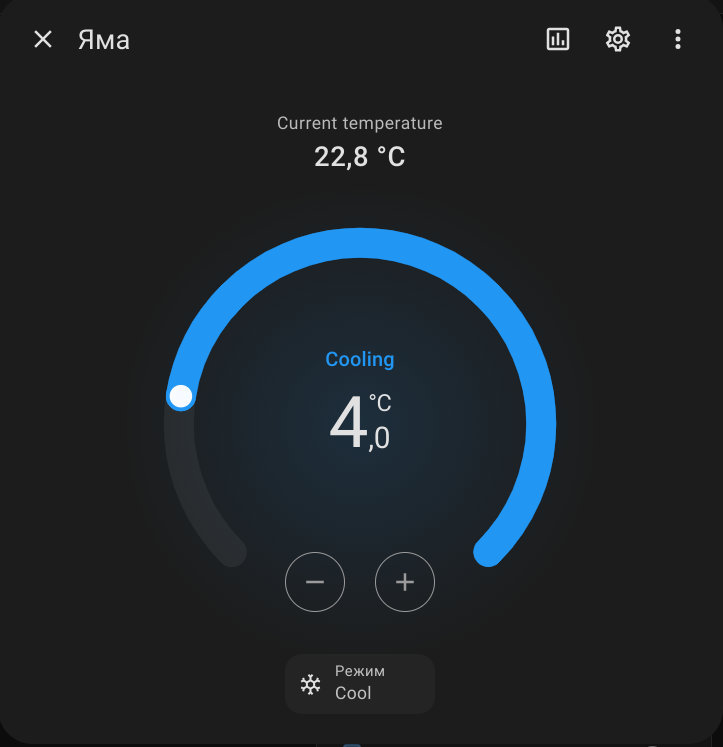
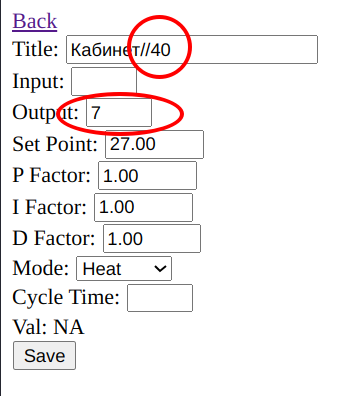

## MegaD для Home Assistant
*Неофициальная версия интеграции.*


#### Поддержать разработку

[](https://www.tinkoff.ru/rm/shutov.mikhail19/wUyu873109)

## Содержание.
* [**_Описание._**](#описание)
* [**_Возможности._**](#возможности)
  * [_Конфигурация._](#конфигурация)
  * [_Особенности._](#особенности)
  * [_Бинарные сенсоры._](#бинарные-сенсоры)
  * [_Сенсоры кнопок._](#сенсоры-кнопок)
  * [_Счётчики._](#счётчики)
  * [_Релейные выходы._](#релейные-выходы)
  * [_Групповые переключатели._](#групповые-переключатели)
  * [_Диммируемые выходы._](#диммируемые-выходы)
* [**_Сенсоры._**](#сенсоры)
  * [_Сенсоры температуры и влажности типа 1wire и dht._](#сенсоры-температуры-и-влажности-типа-1wire-и-dht)
  * [_I2C сенсоры._](#i2c-сенсоры)
  * [_Аналоговые сенсоры._](#аналоговые-сенсоры)
* [**_Терморегуляторы._**](#терморегуляторы)
  * [_В режиме термостата._](#в-режиме-термостата)
  * [_В режиме ПИД._](#в-режиме-пид)
* [**_Блоки расширения I2C._**](#блоки-расширения-i2c)
  * [_MegaD-16I-XT_](#megad-16i-xt)
  * [_MegaD-16R-XT_](#megad-16r-xt)
  * [_MegaD-16U-XT_](#megad-16u-xt)
* [**_В планах._**](#в-планах)
* [**_Установка._**](#установка)
* [**_Настройка._**](#настройка)
  * [_Логирование._](#логирование)

## Описание.
Компонент для управления устройствами [MegaD](https://ab-log.ru/) из Home Assistant (далее НА). 
Работоспособность проверялась на прошивке версии 4.65b7 (моноблок).

> [!IMPORTANT]
> Поддерживаемая версия Home Assistant 2025.1.0 и выше.

> [!IMPORTANT]
> Для корректной работы интеграции после каждого обновления конфигурации
> контроллера необходимо заново прочитать настройки контроллера интеграцией. 
> И выбрать сохранённый файл для обновления данных в НА. Это делается из 
> интерфейса НА, кнопкой "Настроить" у устройства.

> [!WARNING]
> Интеграция находится на начальной стадии разработки.
> Ниже приведён функционал на данный момент.
 
## Возможности.
### Конфигурация.
При добавлении нового устройства в НА, вам будет предложено ```Добавить новое устройство```
или ```Найти устройство и изменить IP-адрес```. Если ваш контроллер не настроен,
то интеграция всё равно найдёт все устройства в сети и сможет изменить IP-адрес на нужный,
даже если адрес плк другой подсети. Например: если ваша сеть 192.168.1.0, а устройство
с адресом 192.168.0.14, то с помощью интеграции можно поменять IP-адрес на 192.168.1.10.

Интеграция умеет сохранять конфигурацию контроллера и записывать её обратно в MegaD.
Если что-то случится с устройством, то можно заменить его и записать сохранённую 
конфигурацию. И не придётся настраивать всё вручную.
Файлы конфигурации сохраняются в каталог `custom_components/config_mega`
В конфигурации интеграции можно указывать не только ip адрес, но и доменное имя.

Для корректной работы интеграции, необходимо в главной конфигурации контроллера
указать в поле "Script" значение: megad. Тип сервера: HTTP. Адрес сервера HA
(например: 192.168.1.20:8123). Если добавляете несколько контроллеров в НА, 
то необходимо указать id в настройках устройства.

> [!TIP]
> У кого устройство не поддерживает поле "Title"!
> 
> При старте интеграция читает сохранённый конфигурационный файл контроллера. 
> Если нужна инверсия порта или изменить его тип в НА или задать имя, то можно
> вручную добавить параметр "emt" в настройку этого порта. 
> 
> Например 
> 
>`pn=4&ecmd=&af=&eth=&misc=&d=&mt=&emt=%CA%EE%F0%E8%E4%EE%F0%2Fm%2F1&pty=0&naf=0&m=1&nr=1`
> 
> тут у параметра `emt` значение `%CA%EE%F0%E8%E4%EE%F0%2Fm%2F1` (URL кодировка), 
> что декодируется в `Коридор/m/1` (Имя в НА = Коридор / класс в НА motion / 
> инверсия установлена). Если не нужно имя, то можно прописать значение `/m/1`
> без кодирования. Или использовать имя латинскими буквами.


### Особенности

* При перезагрузке контроллера, интеграция восстанавливает состояние выходов до 
перезагрузки.
* Синхронизация времени с сервером происходит раз в сутки в 2:00 и при 
перезагрузке контроллера.
* Обновление данных всех сенсоров примерно 1 раз в минуту.


### Бинарные сенсоры.
В НА добавляются порты в качестве бинарного сенсора только те порты IN у которых в интерфейсе
MegaD в поле "Mode" стоит значение "P&R" или значения "P", "R" но если установлена
галочка ☑ у этого поля. В противном случае порт будет добавлен как [счетчик](#счётчики) или [сенсор кнопки](#сенсоры-кнопок)
В поле "Title" порта (настройка MegaD) можно указать название сенсора, его тип и инверсию.
**Помните, что контроллер ограничивает это поле 25 символами.**

Формат: имя сенсора/тип устройства/инверсия
* Имя устройства может быть любым, главное ограничение количество символов
* Тип устройства состоит из 1 или 2 букв английского алфавита. Поддерживаемые типы устройств:
    - Движение (motion) --> m
    - Окно (window) --> w
    - Дверь (door) --> d
    - Гаражные ворота (garage_door) --> gd
    - Замок (lock) --> l
    - Обнаружение влаги (moisture) --> ms
    - Обнаружение дыма (smoke) --> s
* Инверсия имеет значения 1 или 0. По умолчанию 0.

> ✳ при необходимости поддержи других типов, создавайте issues.

Примеры:
* `Дверь/d` --> Имя "Дверь" / Тип в НА door / инверсии нет
* `Коридор/m/1` --> Имя "Коридор" / Тип в НА motion / инверсия установлена
* `Плита` --> Имя "Плита" / Тип в НА None / инверсии нет


### Сенсоры кнопок.

Порты IN которые настроены в режиме "Click", добавляются в НА как сенсоры кнопок.

Возможные состояния такого сенсора:
* `single` --> одиночное нажатие
* `double` --> двойное нажатие
* `long` --> длительное нажатие
* `off` --> состояние по умолчанию

### Счётчики.

У каждого порта с типом "IN" есть дополнительный параметр число срабатывания порта.
Это число добавляется в НА отдельным сенсором. Логику работы счётчика смотрите 
в [документации MegaD](https://ab-log.ru/smart-house/ethernet/megad-2561#conf-in-cnt).


### Релейные выходы.

По умолчанию релейные выходы в НА добавляются как switch. 
В поле "Title" порта (настройка MegaD) можно указать название устройства, его 
тип и инверсию. Ограничение поля по длине 25 символов.

Формат: имя сенсора/тип устройства/инверсия
* Имя устройства может быть любым, главное ограничение количество символов
* Тип устройства состоит из 1 или 2 букв английского алфавита. Поддерживаемые типы устройств:
    - Переключатель (switch) --> s
    - Освещение (light) --> l
    - Вентиляция (fan) --> f
* Инверсия имеет значения 1 или 0. По умолчанию 0. Полезна при подключении нагрузки к нормально замкнутым контактам.


### Групповые переключатели.

В настройках контроллера есть такое понятие как группы устройств. Интеграция 
добавляет такие группы как отдельный переключатель (switch). Подробней о настройке
групп смотрите в [документации](https://ab-log.ru/smart-house/ethernet/megad-2561#conf-out-gr).
Использование групповых переключателей снижает нагрузку на контроллер.

Групповой переключатель не имеет статуса состояния. 
> [!TIP]
> Инверсированые выходы при выключении группы будут переходить 
> во включенное состояние и наоборот.


Если управлять в НА через действия:
* switch.turn_on --> включает все порты в группе
* switch.turn_off --> выключает все порты в группе
* switch.toggle --> переключает состояние всех портов в группе. (даже если состояния были в разнобой)


### Диммируемые выходы.

В НА диммируемые выходы добавляются как освещение (light) с возможной установкой
яркости светильника. В настройке контроллера у выхода PWM есть поле "Min", где
можно выставить минимальное значение с которого НА начнёт управление яркостью.
Все значения ниже этой яркости для НА будут означать выключенное состояние.
Для плавного диммирования необходимо установить галочку в поле "Smooth" в 
настройках порта контроллера. Подробнее смотрите в 
[документации](https://ab-log.ru/smart-house/ethernet/megad-2561#conf-out-pwm)

Есть возможность изменить тип устройства в поле "Title".

Формат: имя сенсора/тип устройства
* Имя устройства может быть любым, главное ограничение количество символов
* Тип устройства состоит из 1 или 2 букв английского алфавита. Поддерживаемые типы устройств:
    - Освещение (light) --> l
    - Вентиляция (fan) --> f


## Сенсоры.

Показания сенсоров обновляются примерно раз в минуту.

В НА добавляются и отображаются следующие сенсоры:
1. Собственные сенсоры контроллера:
   * Температура платы
   * Uptime (продолжительность работы)
2. Сенсоры температуры 1 wire (так же подключение шиной).
3. Сенсоры температуры и влажности DHT11, DHT22
4. I2C сенсоры (перечень интегрированных в НА смотрите ниже)

### Сенсоры температуры и влажности типа 1wire и dht.

Если порт настроен как цифровой датчик "DSen" с типом сенсора "1W", "DHT11" или
"DHT22", то в НА добавляются все доступные сенсоры на этих портах. 

### I2C сенсоры.

Добавление I2C устройств сложный процесс, нужно добавлять каждый датчик отдельно.
Поэтому по мере необходимости буду их добавлять.

Поддерживаемые сенсоры:
- SCD4x (CO2, температура, влажность)
- MBx280 (температура, атмосферное давление, влажность)
- SHT31 (температура, влажность)
- HTU21D (температура, влажность)

### Аналоговые сенсоры.

Аналоговые сенсоры добавляются со значением сырых данных из контроллера
в пределах от 0 до 1023. Подробней смотрите в 
[документации](https://ab-log.ru/smart-house/ethernet/megad-2561#conf-adc).


## Терморегуляторы.

### В режиме термостата.

На данный момент в НА добавляются терморегуляторы с гистерезисом для порта 
"DSen" с типом сенсора "1W" при указании "Mode" = "<>" и отмеченной галочкой 
поля "Action".

<details>
<summary>Пример настройки порта</summary>



</details>
<details>
<summary>Вид терморегулятора в НА</summary>



</details>

Поле "Title" имеет формат: имя/тип терморегулятора/инверсия.
* Имя устройства может быть любым.
* Тип устройства состоит из 1 буквы английского алфавита. От типа зависят пределы
регулирования температуры.
Поддерживаемые типы устройств:
  - Домашний (home) --> h (5℃ - 30℃)
  - Водонагреватель (boiler) --> b (30℃ - 80℃)
  - Погреб (cellar) --> c (0℃ - 20℃)
  - Пол (floor) --> f (15℃ - 45℃)

* Инверсия имеет значения 1 или 0. Если инверсия включена, то терморегулятор работает на охлаждение.

Для терморегулятора нагрева в поле "Action" синхронизируйте действие порта  
противоположно состоянию входа (например 8:4). Для терморегулятора охлаждения - 
соответствующе состоянию входа (например 9:3). При этом нагрузка должна быть подключена 
на нормально разомкнутые контакты реле.

Пример настройки терморегулятора для овощной ямы, где, предположим, реле включает 
нагрузку охлаждения (например приток с улицы).
<details>
<summary>Настройка порта для режима охлаждения</summary>



</details>
<details>
<summary>Вид терморегулятора в НА</summary>



</details>

> [!TIP]
> При перезагрузке контроллера сервер НА восстанавливает состояние терморегулятора.
> А именно, включен или выключен, установленную температуру. Если контроллер
> перезагрузится без НА или загрузится раньше сервера, то терморегулятор будет 
> во включенном состоянии с установленной температурой из энергонезависимой 
> памяти плк. 

> [!WARNING]
> Выключение и включение терморегулятора возможно с версии прошивки 
> контроллера 4.65beta4

### В режиме ПИД.

Контроллеры MegaD начиная с версии прошивки 4.61 beta4 поддерживают ПИД регулирование.
Подробнее о настройке смотрите в [документации](https://ab-log.ru/smart-house/ethernet/megad-2561#pid). 
Интеграция умеет добавлять термостат для таких терморегуляторов. 

Что бы терморегулятор добавился в НА необходимо:
1. В поле "Title" добавить порт датчика температуры -> имя в НА/тип устройства/номер порта сенсора
   * Кабинет/h/40 --> Кабинет, (5℃ - 30℃), Порт №40
   * //38 --> Имя по умолчанию, (5℃ - 30℃), Порт №38
2. В поле "Output" должен быть прописан порт которым вы будете управлять.

<details>
<summary>Пример настройки ПИД в MegaD</summary>



</details>

Поле "Mode" определяет в каком режиме будет работать терморегулятор в НА.
* Нагревательный --> mode = heat
* Охладительный --> mode = cool
* Автоматический --> mode = balance

В НА добавляется 2 режима, это "Выключено" и один из трёх приведённых выше.
Так же интеграция добавляет в НА коэффициенты ПИД с возможностью изменять их 
(шаг 0,01) и текущее расчетное значение "Value".


## Блоки расширения I2C.
Теоретически поддерживаются все блоки расширения типами модуля PCA9685 и MCP230ХХ.
* **MegaD-16U-XT**
* MegaD-16PWM
* **MegaD-16R-XT**
* **MegaD-16I-XT**
* MegaD-16M-XT
* MegaD-16MP-XT

У модулей PCA9685 есть возможность добавлять выходы в группу. Номер группы общий
для всех портов контроллера. Про группы выходов в интеграции описано [тут](#групповые-переключатели). 

Ниже приведено краткое описание модулей которые были протестированы.

### MegaD-16I-XT
Краткая информация по модулю [тут](https://ab-log.ru/devices/MegaD-16I-XT).

Данный модуль подключается к 2-м любым цифровым портам контроллера по шине I2C, 
и к одному порту настроенному как IN контроллера для уведомления плк о сработке 
порта блока расширения. Подробная инструкция в [документации](https://ab-log.ru/smart-house/ethernet/megad-2561#conf-exp-mcp).

Этот модуль используется для расширения входов ([бинарных сенсоров](#бинарные-сенсоры)) контроллера.
В поле Title действуют такие же правила, как и для стандартных входов MegaD.

### MegaD-16R-XT
Краткая информация по модулю [тут](https://ab-log.ru/devices/MegaD-16R-XT).

Модуль расширяет количество релейных выходов контроллера (16 реле). В НА по умолчанию
добавляются как класс switch. Изменить класс можно через поле Title по тем же 
правилам как для стандартных [релейных выходов](#релейные-выходы).

### MegaD-16U-XT
Краткая информация по модулю [тут](https://ab-log.ru/devices/MegaD-16U-XT).

Данный модуль расширяет количество диммируемых выходов, а также релейных.
Настройки поля Title такие же, как для стандартных [диммирумемых выходов](#диммируемые-выходы)


## В планах

- [x] ~~Добавление бинарных сенсоров с настройкой класса устройства для НА~~
- [x] ~~Добавление сенсоров кнопок с поддержкой одиночного, двойного, долгого нажатий~~
- [x] ~~Добавление сенсоров счётчиков от портов с типом "IN"~~
- [x] ~~Добавление релейных выходов с настройкой класса устройства для НА~~
- [x] ~~Поддержка управления группами созданных в настройках контроллера~~
- [x] ~~Добавление диммируемых выходов в НА~~
- [x] ~~Функционал перезагрузки интеграции~~
- [x] ~~Функционал перенастройки интеграции~~
- [x] ~~Первый релиз интеграции для HACS~~
- [x] ~~Добавление 1wire сенсоров~~
- [x] ~~Добавление сенсоров dht сенсоров~~
- [x] ~~добавление 1wire сенсоров в шине~~
- [x] ~~Добавление I2C сенсоров~~
- [x] ~~Аналоговые датчики~~
- [x] ~~Восстановление состояния портов после перезагрузки контроллера~~
- [x] ~~Добавление терморегуляторов в НА на основе сенсоров (с гистерезисом)~~
- [x] ~~Добавление терморегуляторов в НА на основе ПИД регуляторов~~
- [x] ~~Добавить поддержку I2C блоков расширителей~~
- [ ] Обновление прошивки контроллера из НА

*Свои предложения можете писать в issues*

## Установка.
**Способ 1.** [HACS](https://hacs.xyz/) -> Интеграции -> 3 точки в правом верхнем углу -> Пользовательские репозитории

Далее вставляем репозиторий https://github.com/MihVS/megad выбираем категорию "Интеграция" и жмём добавить.
***
**Способ 2.** Вручную скопируйте каталог `megad` в директорию `/config/custom_components`
***
### **Не забываем поставить ⭐ интеграции.**

## Настройка.
> Настройки -> Интеграции -> Добавить интеграцию -> **MegaD-2561**
 

### Логирование.
Чтобы изменить уровень логирования, для выявления проблем, необходимо в файле `configuration.yaml` добавить:
```yaml
logger:
  logs:
    custom_components.megad: debug
```

## Разработчик
**[Михаил Шутов](https://github.com/mihvs)**